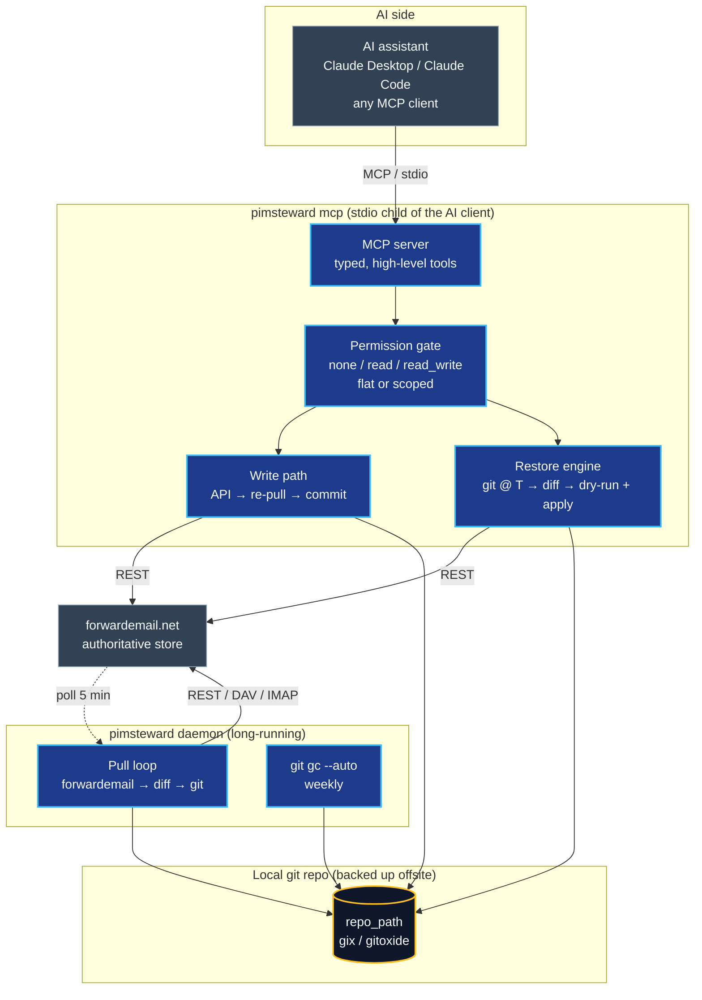
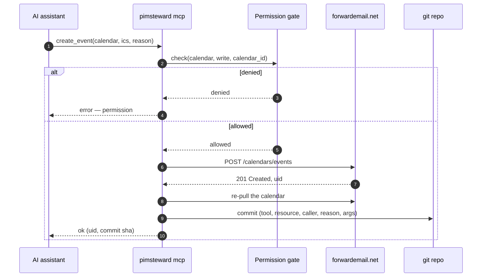
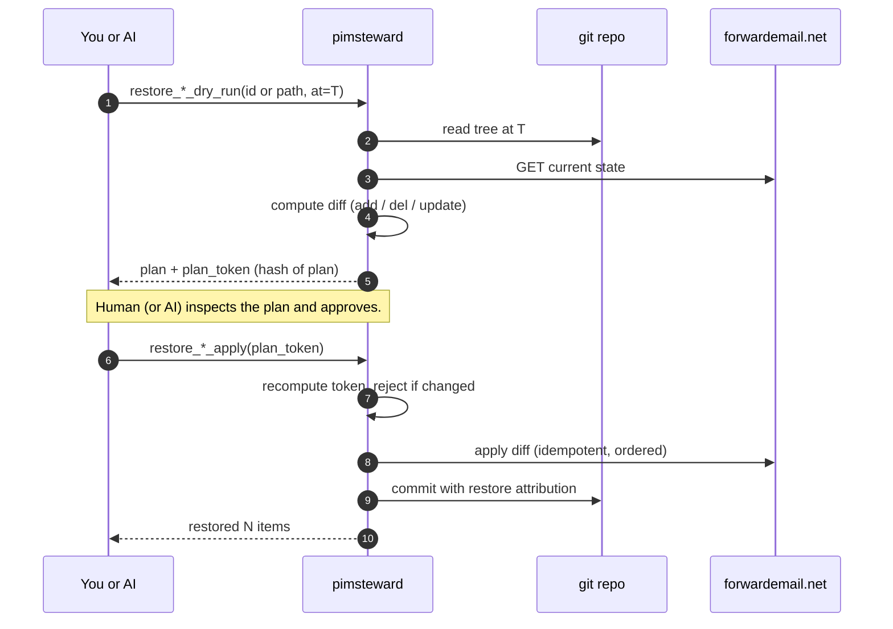

<p align="center">
  
</p>

<p align="center">
  <a href="LICENSE"></a>
  
  
  
  <a href="PLAN.md"></a>
</p>

> **pimsteward** is a **PIM steward for [forwardemail.net](https://forwardemail.net)** — a
> permission-aware MCP mediator between an AI assistant and your mail, calendar,
> contacts, and sieve rules, with time-travel backup built in.

---

## Why pimsteward exists

Giving an AI assistant access to your personal data is a one-way trust decision
**unless you have receipts**. An MCP server that hands raw IMAP/CalDAV
credentials to an LLM is a liability — one hallucinated tool call away from
deleting a decade of archived mail or rewriting your calendar.

pimsteward is the **receipts layer** between the model and your data:

- The AI talks to pimsteward over MCP. It **never** sees your credentials.
- Every write is gated by a per-resource permission policy you control.
- Every change — whether it came from the AI, your phone's CalDAV client, or
  forwardemail itself — lands in a **local git repo** as a time-series log.
- If something goes wrong, you **rewind** by file, directory, or date range.

If the AI deletes all your events next month, you restore them. If you just want
to see what it changed today, you ask `git log`.

---

## Why [forwardemail.net](https://forwardemail.net)

pimsteward is a forwardemail-only tool on purpose. A mediator like this needs
a backend with a real programmatic surface, stable resource ids, and
credentials that can be scoped to a single mailbox — forwardemail has all
three.

- **A real, first-class REST API.** forwardemail ships a
  [well-documented REST API](https://forwardemail.net/en/email-api) covering
  mail, folders, calendars, contacts, sieve filters, aliases, and domains.
  It's not a scraping-friendly afterthought bolted onto a webmail UI — it's
  the same API the service uses internally. JSON in, JSON out, pagination,
  cursors, the lot.
- **Alias-scoped credentials.** Every alias gets its own username/password
  that authorises *only* that alias's data. pimsteward holds an alias
  credential, not a god-mode account token, so the blast radius of the
  daemon is exactly one mailbox.
- **Programmatic by design.** IMAP, CalDAV, CardDAV, and the REST API all
  see the same authoritative store. You can read mail with the REST API,
  write events with CalDAV from your phone, manage sieve rules from a
  script, and pimsteward's pull loop will still capture every change —
  because forwardemail exposes the full state through every interface.
- **Open-source and
  [privacy-focused](https://forwardemail.net/en/privacy).** The
  [service itself is open-source](https://github.com/forwardemail/forwardemail.net),
  quota and rate limits are published, and the company's business model is
  paid accounts rather than mining your mail. That matters when you're
  deciding which provider gets to sit under an AI mediator.
- **MCP-friendly shape.** Because every resource (message, event, vcard,
  sieve script) is addressable by a stable id through a typed API, it maps
  cleanly onto a small set of MCP tools. pimsteward's MCP layer is thin —
  permission check, forwardemail call, git commit — precisely because the
  backend was already programmatic.

If forwardemail didn't exist, pimsteward would need to be five times the code
and half as reliable. Give them [a look](https://forwardemail.net) if you're
shopping for an email host.

*I'm not affiliated with forwardemail — just a happy paying user.*

---

## What it does

<table>
<tr>
<td width="33%" valign="top">

### Mediates
Your AI talks to pimsteward over MCP, not to forwardemail directly.
pimsteward holds the credentials, enforces a per-resource permission
policy, and attributes every write so you can see exactly what the AI
changed — and when, and why.

</td>
<td width="33%" valign="top">

### Backs up
Every change to your calendars, contacts, mail, or sieve scripts lands
in a local git repository as a time-series log. Whether the change
came from your AI, your IMAP/CalDAV client, or forwardemail itself,
it's captured, diffed, and committed.

</td>
<td width="33%" valign="top">

### Restores
Rewind any file, directory, or date range back to a prior state,
selectively. Your AI can drive the restore too — but only through a
dry-run tool that requires explicit confirmation before any bytes
are written back to forwardemail.

</td>
</tr>
</table>

---

## What can you do with this?

Once pimsteward is wired up to your AI assistant, "PIM assistant" stops being
a demo and starts being a daily driver. Some of the things it's built for:

#### 📬 Mail — triage, search, summarise, send
- **"What landed in my inbox this week that I haven't replied to?"** — the AI
  runs a proper full-text + header search via forwardemail's API, summarises,
  and proposes next actions.
- **"Move anything from my accountant into the `taxes/` folder."** — batch
  label/move operations across folders, logged and reversible.
- **"Draft a reply to the Monday thread, polite decline."** — the AI writes
  into your Drafts folder; you hit send. This is the safe default.
- **"Send the polite decline I drafted yesterday."** — once you've granted
  the separate `email_send` permission (see below), the AI can actually
  put mail on the wire via forwardemail's SMTP bridge. Every send is a git
  commit with `tool: send_email` in the audit trailer carrying recipients,
  subject, and body sha256 — irreversible, but fully recorded.
- **"Find every email that mentions project Gemini between Feb and April."**
  — advanced search passed through to forwardemail, with results streamed
  back over MCP so the assistant can reason across the full corpus.

#### 🧹 Mail filtering — sieve rules as code
- **"Any email from `@forwardemail.net` should skip the inbox and land in
  `providers/`."** — the AI proposes a sieve rule; pimsteward previews the
  diff against your current script, commits it, and uploads it.
- **"Auto-archive newsletters older than a week."** — pimsteward edits
  your sieve script, commits to git, and you get a clean rollback path if
  the rule turns out to be too aggressive.
- Every sieve change is a git diff you can `blame`, `revert`, or time-travel.

#### 📅 Calendar — scheduling without the dance
- **"Find me three 30-minute slots next week that don't clash with travel."**
  — the AI reads your calendars and proposes slots.
- **"Book it, invite Sam, title 'design review'."** — an actual `create_event`
  write, committed to git with AI attribution.
- **"Undo everything the AI moved on my calendar today."** — one restore
  tool call, dry-run plan first, then apply.

#### 👥 Contacts — dedupe, enrich, tidy
- **"Merge the two 'Alex Kim' entries and keep the newer phone number."**
- **"Add everyone I've exchanged more than five emails with this year to my
  address book."**
- **"Who on my contact list is missing a company?"** — AI reads, proposes
  patches, writes vcards on approval.

#### ⏪ Time-travel across all of it
- **"What did my calendar look like on March 1st before the reorg?"** —
  pimsteward checks out the git tree at that timestamp and hands it back.
- **"Show me every change the AI made to my contacts this month."** —
  `git log` restricted to the contacts path, filtered by the `ai:` commit
  prefix.
- **"Restore my `newsletters/` folder to where it was Friday morning."** —
  dry-run diff, confirm, apply.

The through-line: **everything the AI does is a commit, everything is
reversible, everything is attributable.**

---

## Architecture

pimsteward is a single daemon that owns your forwardemail credentials and sits
between the AI assistant and the service. It exposes an MCP server upward, a
git repository sideways, and the forwardemail REST API downward.



### Four loops, one data store

| Loop        | Trigger                          | What happens                                                         |
| ----------- | -------------------------------- | -------------------------------------------------------------------- |
| **Pull**    | `pimsteward daemon` tick (~5 min)| Poll forwardemail, diff against the git tree, commit any new state   |
| **Write**   | MCP tool call                    | Check permission, apply via API, re-pull the resource, commit        |
| **Restore** | MCP tool (dry-run then apply)    | Read git tree at time T, compute diff vs live, apply as a new commit |
| **GC**      | `pimsteward daemon` (weekly)     | `git gc --auto` so the offsite-mirrored backup stays compact         |

The daemon owns Pull and GC. MCP is a separate process: the AI client spawns
`pimsteward mcp` as a stdio child, so Write and Restore run in that short-lived
process and commit to the same git repo the daemon is pulling into.

---

## How a write actually works

Every AI-initiated mutation is permission-checked, applied to forwardemail,
then reconciled into git as a single attributed commit. The pull loop is the
reconciliation engine — after the write, pimsteward re-reads the affected
resource so what lands in git is the authoritative post-write state rather
than pimsteward's optimistic guess.



---

## Restore — with a safety net

Restore is the feature pimsteward exists for. It is also the feature most
likely to be catastrophic if it goes wrong, so the tool is **dry-run by
default** and requires an explicit confirmation token to apply.



### Restore in practice

Restore is driven by the AI through MCP — there is no separate restore CLI,
and by design there never will be. If the AI is trusted enough to write, it
is trusted enough to drive its own undo (behind a dry-run+confirm gate). You
ask your assistant to fix the mistake in plain English; it picks the right
MCP tool and walks you through the plan before any byte goes back over the
wire.

The tools come in type-specific dry-run / apply pairs:

| Resource        | Dry-run tool                    | Apply tool                    |
| --------------- | ------------------------------- | ----------------------------- |
| Contact         | `restore_contact_dry_run`       | `restore_contact_apply`       |
| Sieve script    | `restore_sieve_dry_run`         | `restore_sieve_apply`         |
| Calendar event  | `restore_calendar_event_dry_run`| `restore_calendar_event_apply`|
| Mail message    | `restore_mail_dry_run`          | `restore_mail_apply`          |
| Arbitrary path  | `restore_path_dry_run`          | `restore_path_apply`          |

Every `*_dry_run` returns a plan plus a `plan_token` derived from the plan's
contents. The matching `*_apply` refuses to run unless you hand it back the
exact token — so a plan the human didn't see cannot be rubber-stamped, and a
plan that changed between inspection and apply invalidates its own token.

A typical exchange looks like this:

> **You:** *That newsletter I actually read — Signal Weekly — got swept into
> `Archive/Newsletters` when you cleaned up my inbox this morning. Put it
> back.*
>
> **AI:** *I found it. Commit `a1b2c3d` moved it from `INBOX` to
> `Archive/Newsletters` at 08:14 this morning as part of a batch of fifteen.
> Running `restore_mail_dry_run` against the commit just before that move.*
>
> *Plan: 1 message will be moved `Archive/Newsletters → INBOX`. The other
> fourteen stay where they are. Token: `a1b2c3d4`. Want me to apply it?*
>
> **You:** *Yes.*
>
> **AI:** *`restore_mail_apply` with that token — done. One new commit on
> the backup repo, attributed to me with reason "user asked to undo
> accidental archive of Signal Weekly".*

The same shape works for a rewritten sieve script (`restore_sieve_dry_run`
with `at = "2026-04-04T09:00Z"`), a wrongly-merged contact
(`restore_contact_dry_run` at `HEAD~1`), or any file under the backup tree
(`restore_path_dry_run`). The pattern is always **narrow the scope, pick
the time, dry-run, confirm, apply** — and the AI is the one running it,
under your eye.

If you want to inspect what happened before asking for a restore, the
`history` MCP tool is `git log` for the backup tree — it returns the
commits that touched a given path, newest first, so the AI can point at
the exact commit you want to revert to.

---

## Auditing what the AI did

pimsteward is a backup *and* an audit tool. Every mutation is a git commit
with a structured attribution block — `git log` is your audit log, and the
git author name tells you the provenance at a glance:

- `pimsteward-pull` — the pull daemon reconciled remote state into the tree.
- `ai` (or whatever caller name the MCP session set) — an AI-driven write.
- Anything else — a human-initiated write you kicked off yourself.

### Commit shape

Every mutation commit embeds a YAML-ish attribution block delimited by
`---` lines in the commit body. The subject line is the human summary.

```
contacts: update_contact abc123

---
tool: update_contact
resource: contacts
resource_id: abc123
caller: ai
reason: "user asked me to fix Alex Kim's phone number"
args: {"full_name":"Alex Kim","phone":"+1-555-0142"}
---
```

`tool:` names the MCP tool that was invoked. `resource:` is one of `email`,
`calendar`, `contacts`, `sieve`. `resource_id:` is the forwardemail id of
the thing that changed. `caller:` identifies who drove the write (matches
the git commit author). `reason:` is the free-text justification the AI
(or human) attached to this specific call. `args:` is the JSON payload so
you can reproduce or audit the exact request.

### Asking "what did the AI change today?"

```sh
# Every AI-authored change today, newest first.
git -C /var/lib/pimsteward log --since=midnight --author='^ai$'

# Same question, but with the files touched.
git -C /var/lib/pimsteward log --since=midnight --author='^ai$' --name-status

# Every mutation that invoked a specific tool.
git -C /var/lib/pimsteward log --all --grep='^tool: move_email$'

# Everything the AI did to one folder's worth of mail.
git -C /var/lib/pimsteward log --author='^ai$' -- \
    'sources/forwardemail/*/mail/INBOX/'

# "Who last touched this calendar event?"
git -C /var/lib/pimsteward blame \
    sources/forwardemail/*/calendars/<cal_id>/events/<uid>.ics
```

Because the repo is just git, **everything you already know about git works
here**. `git log -p`, `git log --stat`, `gitk`, `tig`, `lazygit`, VS Code's
git lens — all of them become audit tools for your AI. The `history` MCP
tool gives the AI the same view, so you can ask "what have you changed in
my inbox this week?" inside a conversation and get back a real `git log`
answer, not a hallucinated summary.

---

## Permission model — a trust gradient you control

Trust in an AI assistant is not binary, and neither is pimsteward. You set one
policy per resource type, and you turn the dials up as the assistant earns it.

| Level            | What the AI can do                                                        | Where it makes sense               |
| ---------------- | ------------------------------------------------------------------------- | ---------------------------------- |
| **`none`**       | Resource is invisible — the MCP tools aren't even registered              | Data you simply don't want AI near |
| **`read`**       | Search, read, summarise, quote — zero writes                              | The safe default for everything    |
| **`read_write`** | Full mailbox CRUD: create drafts, update flags, move, delete. **Not send.** | Once the AI has earned it          |

**Sending mail over SMTP is its own separate permission** (`email_send`,
covered below). `read_write` on email does not grant send and never will —
the blast radius of `POST /v1/emails` is strictly larger than any mailbox
mutation, and that asymmetry is worth an extra opt-in.

For the "let the AI draft replies but never touch the rest of my mail"
middle ground, use a **scoped** permission (documented below) rather than a
dedicated level — you grant `read` at the default and `read_write` on just
the `Drafts` folder. Same effect, but the rule lives in one place and the
audit story stays identical.

### A typical progression

**Week one — "read-only everywhere that matters."**

```toml
[permissions]
email    = "read"         # AI can search and summarise, never modify
calendar = "read_write"   # calendar mistakes are cheap and reversible
contacts = "read_write"   # same — and dedupe is a great first task
sieve    = "read"         # look but don't touch your filter rules yet
```

Your assistant can triage your inbox, summarise threads, find meetings,
propose sieve rules as *suggestions* — but it cannot touch a single byte of
mail. This is where most people should start.

**Month two — "you can draft, I'll send."**

```toml
[permissions]
contacts = "read_write"
sieve    = "read_write"   # AI now owns your filter rules (every change is a git diff)

# Email: read everywhere, write only to Drafts. This is the "drafts tier"
# everyone wants from an AI mail assistant, expressed as a scoped rule.
[permissions.email]
default = "read"
[permissions.email.folders]
"Drafts" = "read_write"

[permissions.calendar]
default = "read_write"
```

The scoped form means the AI can compose, quote, and thread replies into
your Drafts folder, but it cannot send, delete, move, or modify any
existing message. You review and hit send yourself.

**Once the AI has earned it — "full trust, with receipts."**

```toml
[permissions]
email      = "read_write"   # triage, file, move, delete — everything except send
email_send = "allowed"      # SEPARATE opt-in; read_write does not imply this
calendar   = "read_write"
contacts   = "read_write"
sieve      = "read_write"
```

At this point the assistant can autonomously triage, reply, file, archive,
*and send mail on your behalf*. The safety net is not the permission bit —
it's the fact that **every mutation is still committed to git with AI
attribution**, and the restore MCP tools can rewind any path to any point in
time. Sends are the one exception that can't be rewound, but they can still
be audited: every `send_email` call lands a commit with the full recipient
list, subject, and a sha256 of the body that was transmitted. You are
trading convenience for the need to occasionally audit a `git log`, not for
blind faith.

### The rest of the config

```toml
# /etc/pimsteward/config.toml
log_level = "info"

[forwardemail]
api_base            = "https://api.forwardemail.net"
alias_user_file     = "/run/pimsteward-secrets/forwardemail-alias-user"
alias_password_file = "/run/pimsteward-secrets/forwardemail-alias-password"

# Source backends. Default is REST for everything; switch calendar/contacts
# to dav for faster bulk pulls, or mail to imap for CONDSTORE/IDLE push.
mail_source     = "rest"    # or "imap"
calendar_source = "rest"    # or "caldav"
contacts_source = "rest"    # or "carddav"

[storage]
repo_path = "/var/lib/pimsteward"

# Per-resource pull intervals used by `pimsteward daemon`. Non-daemon
# subcommands (probe, pull-*) ignore these.
[pull]
mail_interval_seconds     = 300
calendar_interval_seconds = 300
contacts_interval_seconds = 900
sieve_interval_seconds    = 3600
```

There is no `[mcp]` section: pimsteward's MCP server is a stdio transport,
and your MCP client is expected to spawn `pimsteward mcp` as a child
process. Claude Desktop, Claude Code, Cursor, and rockycc all do this the
same way — point them at the `pimsteward` binary and they own the
lifecycle.

Permission checks happen **before** any API call and **before** any git write.
A `none` resource is invisible to the AI: the corresponding MCP tools are not
registered at all, so the model never even learns they exist.

### Scoped permissions — per-folder and per-calendar

The flat `email = "read"` / `calendar = "read_write"` form is the easy path.
When you need finer control, email and calendar both accept a scoped form
with a default plus overrides — per-folder for email, per-calendar-id for
calendar. A scoped override is authoritative: it wins over the default in
both directions, so you can be broadly restrictive and open specific paths,
or broadly permissive and lock specific paths down.

```toml
[permissions]
contacts = "read_write"
sieve    = "read_write"

# Email: read everything, but the AI can only WRITE into Drafts.
[permissions.email]
default = "read"
[permissions.email.folders]
"Drafts" = "read_write"
"Trash"  = "none"         # not even readable

# Calendar: locked down by default, specific calendars opened up.
[permissions.calendar]
default = "none"
[permissions.calendar.by_id]
"cal-work-xyz"     = "read_write"
"cal-family-abc"   = "read"
```

Contacts and sieve stay globally scoped on purpose — forwardemail gives you
one default address book per alias and a flat sieve namespace, so per-item
rules would add friction without meaningful security value.

### Sending mail — `email_send` is its own permission

Everything on the `email` axis above governs **mailbox mutations** —
creating drafts, flipping flags, moving messages, deleting threads. Sending
an outgoing message over SMTP is a different capability, and pimsteward
treats it that way:

```toml
[permissions]
email      = "read_write"   # mailbox CRUD
email_send = "allowed"      # default is "denied" — you must opt in explicitly
```

Why the split? The blast radius of a send is strictly larger than any
mailbox mutation. Mailbox writes stay inside your alias and are reversible
via `restore_mail_*`. `POST /v1/emails` puts bytes in front of third
parties over the public internet, and there is no "undo" once the remote
SMTP server accepts them. `read_write` on `email` therefore **does not
imply** send — you have to write the extra line.

Mechanically, forwardemail uses one alias credential for both IMAP/REST
mailbox access and SMTP sending, so the split isn't enforced at the
transport layer. pimsteward enforces it at the policy layer: the
`send_email` MCP tool calls a dedicated `check_email_send` gate, and the
default `email_send = "denied"` means the tool refuses every call until
you opt in.

Every successful send produces a git commit with a structured audit
trailer:

```
mail: SEND → ["alice@example.com"]: meeting confirmation

---
tool: send_email
resource: mail
resource_id: <forwardemail-returned-id>
caller: ai
reason: "user asked me to confirm the 3pm slot"
args: {"to":["alice@example.com"],"cc":[],"bcc":[],
       "subject":"meeting confirmation",
       "body_sha256":"9f86d081884c7d659a2feaa0c55ad015...",
       "has_text":true,"has_html":false,
       "returned_id":"..."}
---
```

The full body bytes land in git a few seconds later via the automatic pull
that captures the Sent folder. The `body_sha256` in the audit trailer binds
the commit to the exact bytes that were transmitted — so even if the Sent
copy is later deleted, the hash in the audit log still proves what went
out. Enumerate every send with `git log --grep='tool: send_email'`.

If you want the AI to compose outgoing mail without being trusted to put
it on the wire, set `email_send = "denied"` (the default) and use
`create_draft` instead. The assistant writes into your Drafts folder; you
review and hit send yourself. This is the right setting for most people
most of the time.

---

## Storage layout

One repository per forwardemail alias. One file per logical resource. Every
commit is an atomic batch with a YAML attribution block in the body (see
[Auditing](#auditing-what-the-ai-did)) — the git author name (`pimsteward-pull`,
`ai`, or your caller of choice) distinguishes pull, write, and restore
commits at a glance.

```
/var/lib/pimsteward/
├── .git/
└── sources/forwardemail/<alias_slug>/
    ├── calendars/<cal_id>/
    │   ├── _calendar.json               # calendar manifest (name, colour, ctag…)
    │   └── events/
    │       ├── <uid>.ics                # canonical event body
    │       └── <uid>.meta.json          # etag, updated_at, sync hints
    ├── contacts/default/                # one hard-coded book per alias
    │   ├── <uid>.vcf
    │   └── <uid>.meta.json
    ├── mail/
    │   ├── _attachments/<sha256>        # content-addressed, dedup across msgs
    │   └── <folder_path>/               # folder path slugified, e.g. INBOX, Sent
    │       ├── _folder.json             # uid_validity, modseq, last sync
    │       ├── <canonical_id>.eml       # RFC822 body, immutable
    │       └── <canonical_id>.meta.json # flags, source id, labels — mutable
    └── sieve/
        ├── <script_name>.sieve
        └── <script_name>.meta.json
```

Sync state is colocated with the resource it tracks: mail folders carry
their own `_folder.json`, calendars carry `_calendar.json`, contacts and
sieve scripts carry per-item `.meta.json` sidecars. There is no separate
sync state file or mutations log — the git history *is* the log, and every
field that would live in a separate log is already in the commit body.

### Why git (and [gix](https://github.com/GitoxideLabs/gitoxide) specifically)

Git gives us content-addressed storage, diff / blame, time-travel, branching,
and the best ecosystem tooling in the world — for free. gix (gitoxide) is
chosen over git2 (libgit2 bindings) because it's pure Rust, and over jj-lib
because pimsteward's VCS needs are deliberately linear and boring: append-only
writes, single writer, no merge conflicts.

---

## Non-goals

- ❌ **Not a generic backup tool.** Use restic or borg for disk-level backup.
- ❌ **Not a PIM client.** Keep using your favourite IMAP/CalDAV app — pimsteward
  sits alongside it, not in front of it.
- ❌ **Not a multi-provider sync tool.** v1 is forwardemail-only by design.
  A generic PIM mediator is a bigger, different project.
- ❌ **Not a search index.** forwardemail's own search is excellent; pimsteward
  passes queries through rather than re-indexing.
- ❌ **Not a rate-limit bypass.** All AI reads and writes still hit
  forwardemail's API with your credentials — they're just mediated.

---

## Testing

Unit tests run against fakes and never touch the network:

```sh
cargo test
```

The interesting tests are the **end-to-end** suite, which drives the real
forwardemail REST API and IMAP/CalDAV/CardDAV endpoints. Because those tests
create, modify, and delete live resources, they are gated behind an explicit
opt-in **and** a safety guard that refuses to run against anything that isn't
a test alias.

```sh
export PIMSTEWARD_RUN_E2E=1
export PIMSTEWARD_TEST_ALIAS_USER_FILE=/path/to/test-alias-email
export PIMSTEWARD_TEST_ALIAS_PASSWORD_FILE=/path/to/test-alias-password

cargo nextest run --run-ignored all
```

### The `_test` alias safety guard

**Every e2e test must use a forwardemail alias whose localpart contains the
substring `_test`.** The guard lives in
[`src/safety.rs`](src/safety.rs) and runs *before* any client is constructed
or any API call is made. If the alias doesn't match, the test **panics
immediately** — it does not return a `Result` you can `?` past or `let _ =`
away. This is intentional: a safety guard that can be silently swallowed
isn't a safety guard.

Concretely, the rule is:

1. The alias must contain `_test` in its localpart — e.g.
   `pimsteward_test@example.dev` ✅, `dan@example.dev` ❌.
2. The alias must not appear on the **explicit deny list** of known
   production addresses (belt-and-braces; the deny list catches hypothetical
   collisions like someone registering `dan_test` on a production domain).
3. Defense in depth: the repo path used by the test must not live under
   `/data/Backups/` or `/var/lib/pimsteward/` — those are reserved for the
   production daemon. Tests use a `tempfile::tempdir()` repo.

The recommended setup is a dedicated forwardemail alias you create just for
this — something like `pimsteward_test@<your-domain>` — with its own
alias-scoped credentials. Never point the test suite at an alias that holds
real mail, even briefly. The guard will stop you, but not pointing the gun
in the first place is better.

See [CONTRIBUTING.md](CONTRIBUTING.md) for the full e2e walkthrough.

---

## Status

Early development, but the core is working end-to-end:

- **Pull daemon** — functional for mail (REST + IMAP with CONDSTORE/IDLE),
  calendar (REST + CalDAV), contacts (REST + CardDAV), and sieve scripts.
  Weekly `git gc --auto` runs alongside the pull tasks.
- **MCP server** — read tools (`search_email`, `get_email`, `list_folders`,
  `list_calendars`, `list_events`, `list_contacts`, `list_sieve`, `history`)
  and write tools for all four resources (`create_draft`, **`send_email`**,
  `move_email`, `delete_email`, `update_email_flags`, `create_event`,
  `update_event`, `delete_event`, `create_contact`, `update_contact`,
  `delete_contact`, `install_sieve_script`, `update_sieve_script`,
  `delete_sieve_script`).
- **Restore** — dry-run + apply tool pairs for contacts, sieve, calendar
  events, mail, and arbitrary paths, all gated by a content-derived
  `plan_token`.
- **Permission model** — flat and scoped (per-folder / per-calendar-id)
  forms, a separate opt-in `email_send` permission for SMTP delivery, and a
  path-safe deny guard for the test suite.

See [PLAN.md](PLAN.md) for the full design and phased implementation, and
[DESIGN.md](DESIGN.md) for deeper rationale on the trickier decisions.

Contributions welcome — start with [CONTRIBUTING.md](CONTRIBUTING.md).

---

## License

MIT — see [LICENSE](LICENSE).

<p align="center">
  
</p>
