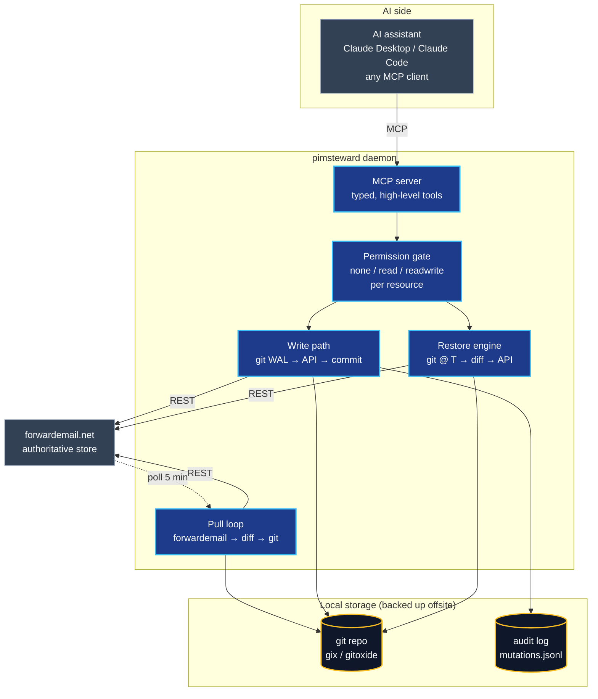
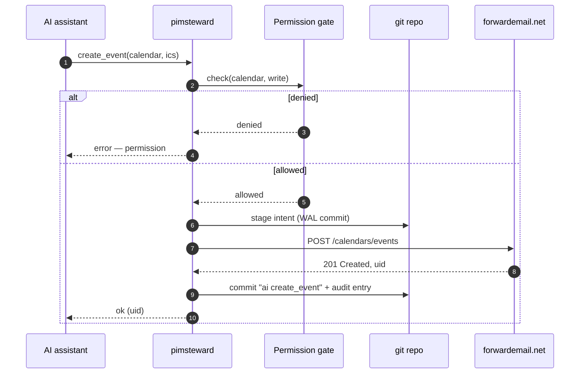
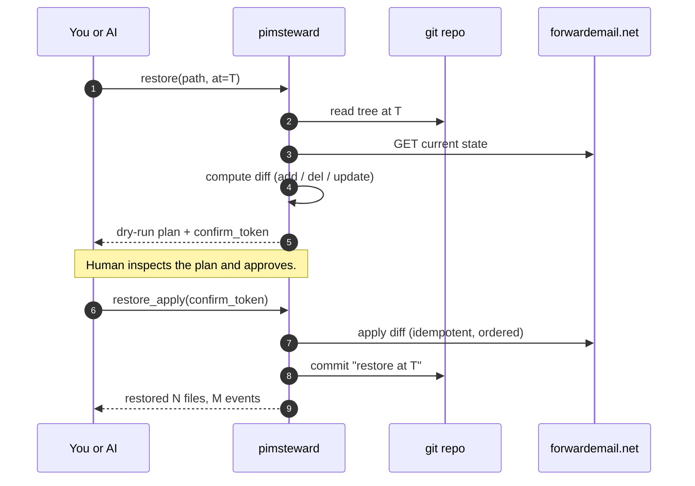

<p align="center">
  
</p>

<p align="center">
  <a href="LICENSE"></a>
  
  
  
  <a href="PLAN.md"></a>
</p>

> **pimsteward** is a **PIM steward for [forwardemail.net](https://forwardemail.net)** — a
> permission-aware MCP mediator between an AI assistant and your mail, calendar,
> contacts, and sieve rules, with time-travel backup built in.

---

## Why pimsteward exists

Giving an AI assistant access to your personal data is a one-way trust decision
**unless you have receipts**. An MCP server that hands raw IMAP/CalDAV
credentials to an LLM is a liability — one hallucinated tool call away from
deleting a decade of archived mail or rewriting your calendar.

pimsteward is the **receipts layer** between the model and your data:

- The AI talks to pimsteward over MCP. It **never** sees your credentials.
- Every write is gated by a per-resource permission policy you control.
- Every change — whether it came from the AI, your phone's CalDAV client, or
  forwardemail itself — lands in a **local git repo** as a time-series log.
- If something goes wrong, you **rewind** by file, directory, or date range.

If the AI deletes all your events next month, you restore them. If you just want
to see what it changed today, you ask `git log`.

---

## Why [forwardemail.net](https://forwardemail.net)

pimsteward is a forwardemail-only tool on purpose. The provider makes this kind
of mediator **possible**, where most mailbox hosts make it painful or outright
hostile.

- **A real, first-class REST API.** forwardemail ships a
  [well-documented REST API](https://forwardemail.net/en/email-api) covering
  mail, folders, calendars, contacts, sieve filters, aliases, and domains.
  It's not a scraping-friendly afterthought bolted onto a webmail UI — it's
  the same API the service uses internally. JSON in, JSON out, pagination,
  cursors, the lot.
- **Alias-scoped credentials.** Every alias gets its own username/password
  that authorises *only* that alias's data. pimsteward holds an alias
  credential, not a god-mode account token, so the blast radius of the
  daemon is exactly one mailbox.
- **Programmatic by design.** IMAP, CalDAV, CardDAV, and the REST API all
  see the same authoritative store. You can read mail with the REST API,
  write events with CalDAV from your phone, manage sieve rules from a
  script, and pimsteward's pull loop will still capture every change —
  because forwardemail exposes the full state through every interface.
- **Open-source and
  [privacy-focused](https://forwardemail.net/en/privacy).** The
  [service itself is open-source](https://github.com/forwardemail/forwardemail.net),
  quota and rate limits are published, and the company's business model is
  paid accounts rather than mining your mail. That matters when you're
  deciding which provider gets to sit under an AI mediator.
- **MCP-friendly shape.** Because every resource (message, event, vcard,
  sieve script) is addressable by a stable id through a typed API, it maps
  cleanly onto a small set of MCP tools. pimsteward's MCP layer is thin —
  permission check, forwardemail call, git commit — precisely because the
  backend was already programmatic.

If forwardemail didn't exist, pimsteward would need to be five times the code
and half as reliable. Give them [a look](https://forwardemail.net) — and, if
you end up running pimsteward, a paid plan.

---

## What it does

<table>
<tr>
<td width="33%" valign="top">

### Mediates
Your AI talks to pimsteward over MCP, not to forwardemail directly.
pimsteward holds the credentials, enforces a per-resource permission
policy, and attributes every write so you can see exactly what the AI
changed — and when, and why.

</td>
<td width="33%" valign="top">

### Backs up
Every change to your calendars, contacts, mail, or sieve scripts lands
in a local git repository as a time-series log. Whether the change
came from your AI, your IMAP/CalDAV client, or forwardemail itself,
it's captured, diffed, and committed.

</td>
<td width="33%" valign="top">

### Restores
Rewind any file, directory, or date range back to a prior state,
selectively. Your AI can drive the restore too — but only through a
dry-run tool that requires explicit confirmation before any bytes
are written back to forwardemail.

</td>
</tr>
</table>

---

## Architecture

pimsteward is a single daemon that owns your forwardemail credentials and sits
between the AI assistant and the service. It exposes an MCP server upward, a
git repository sideways, and the forwardemail REST API downward.



### Four loops, one data store

| Loop         | Trigger                 | What happens                                                            |
| ------------ | ----------------------- | ----------------------------------------------------------------------- |
| **Pull**     | systemd timer (~5 min)  | Poll forwardemail, diff against the git tree, commit any new state      |
| **Write**    | MCP tool call           | Stage intended change, apply via API, commit with AI attribution        |
| **Restore**  | MCP tool or CLI         | Read git tree at time T, compute diff vs live, apply as a new commit    |
| **GC**       | weekly systemd timer    | `git gc --auto` so the offsite-mirrored backup stays compact            |

---

## How a write actually works

Every AI-initiated mutation goes through a **write-ahead log**: the intent is
committed to git *before* the forwardemail API is touched, and the outcome is
committed *after*. That way a crash mid-write never loses attribution or
silently diverges from the remote.



---

## Restore — with a safety net

Restore is the feature pimsteward exists for. It is also the feature most
likely to be catastrophic if it goes wrong, so the tool is **dry-run by
default** and requires an explicit confirmation token to apply.



---

## Permission model

v1 is deliberately **coarse**: one setting per resource type, applied globally.
Per-folder and per-calendar rules are a v2 question.

```toml
# /etc/pimsteward/config.toml

[forwardemail]
api_base            = "https://api.forwardemail.net"
alias_user_file     = "/run/pimsteward-secrets/forwardemail-alias-user"
alias_password_file = "/run/pimsteward-secrets/forwardemail-alias-password"

[storage]
repo_path = "/data/Backups/<host>/pimsteward/<alias_slug>"

[permissions]
# Each: "none" | "read" | "readwrite"
email    = "read"        # AI can search/read but never modify
calendar = "readwrite"   # full CRUD
contacts = "readwrite"
sieve    = "readwrite"

[mcp]
listen = "unix:/run/pimsteward/mcp.sock"
```

Permission checks happen **before** any API call and **before** any git write.
A `none` resource is invisible to the AI — the corresponding MCP tools are not
even registered.

---

## Storage layout

One repository per forwardemail alias. One file per logical resource. Commits
are atomic batches with a machine-readable footer identifying the source
(`pull`, `ai`, `restore`).

```
/data/Backups/<host>/pimsteward/<alias_slug>/
├── .git/
├── sources/forwardemail/<alias_slug>/
│   ├── calendars/<cal_id>/_meta.json
│   ├── calendars/<cal_id>/events/<uid>.ics
│   ├── contacts/<book_id>/_meta.json
│   ├── contacts/<book_id>/<uid>.vcf
│   ├── mail/<folder_id>/_meta.json
│   ├── mail/<folder_id>/<msg_id>/raw.eml         # immutable body + headers
│   ├── mail/<folder_id>/<msg_id>/meta.json       # flags, folder — mutable
│   ├── mail/_attachments/<sha256>                # dedup
│   └── sieve/<script_name>.sieve
├── _sync/
│   └── state.json            # poll cursors, last successful run per resource
└── audit/
    └── mutations.jsonl       # append-only human-readable log of AI writes
```

### Why git (and [gix](https://github.com/GitoxideLabs/gitoxide) specifically)

Git gives us content-addressed storage, diff / blame, time-travel, branching,
and the best ecosystem tooling in the world — for free. gix (gitoxide) is
chosen over git2 (libgit2 bindings) because it's pure Rust, and over jj-lib
because pimsteward's VCS needs are deliberately linear and boring: append-only
writes, single writer, no merge conflicts.

---

## Non-goals

- ❌ **Not a generic backup tool.** Use restic or borg for disk-level backup.
- ❌ **Not a PIM client.** Keep using your favourite IMAP/CalDAV app — pimsteward
  sits alongside it, not in front of it.
- ❌ **Not a multi-provider sync tool.** v1 is forwardemail-only by design.
  A generic PIM mediator is a bigger, different project.
- ❌ **Not a search index.** forwardemail's own search is excellent; pimsteward
  passes queries through rather than re-indexing.
- ❌ **Not a rate-limit bypass.** All AI reads and writes still hit
  forwardemail's API with your credentials — they're just mediated.

---

## Status

Early development. Pull-loop and MCP server are functional; the write path
and restore engine are landing behind them. See [PLAN.md](PLAN.md) for the
full design and phased implementation, and [DESIGN.md](DESIGN.md) for deeper
rationale on the trickier decisions.

Contributions welcome — start with [CONTRIBUTING.md](CONTRIBUTING.md).

---

## License

MIT — see [LICENSE](LICENSE).

<p align="center">
  
</p>
