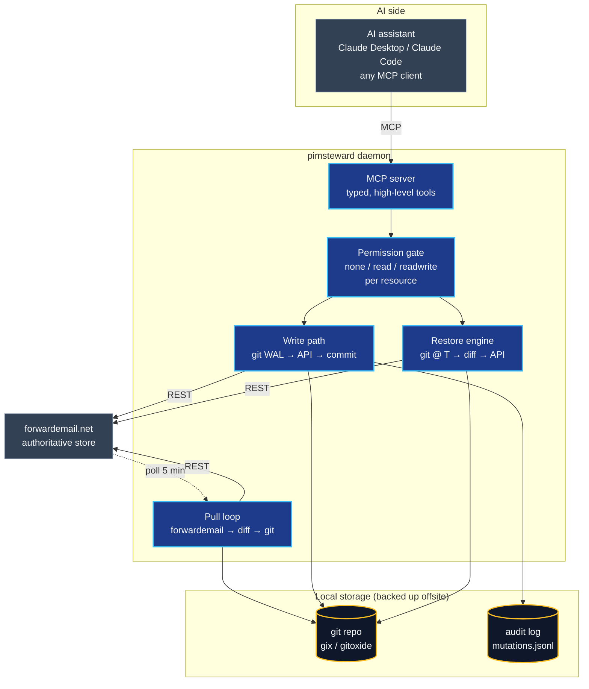
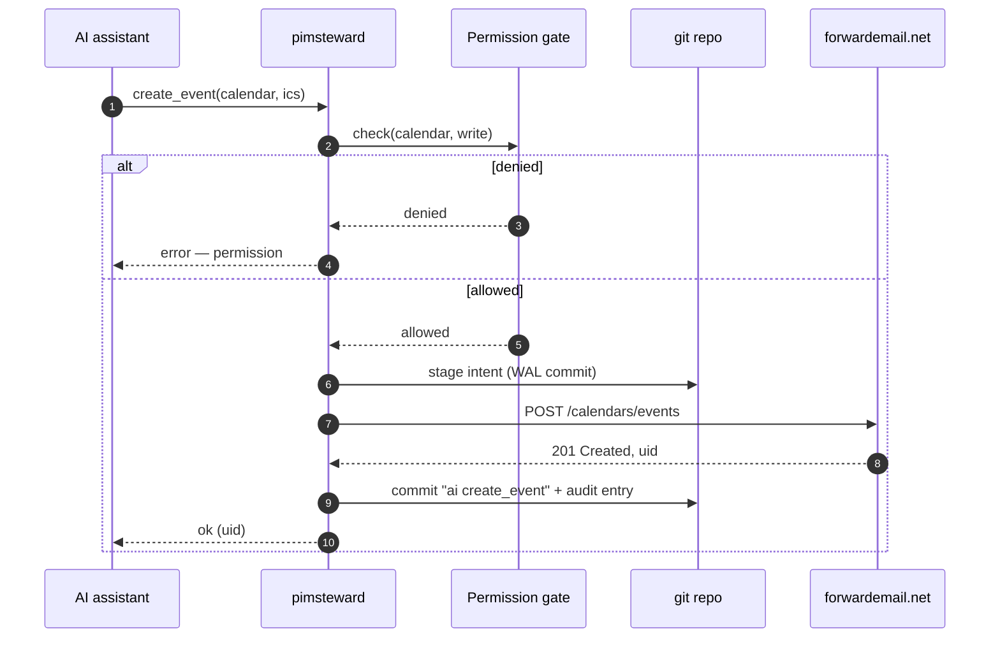
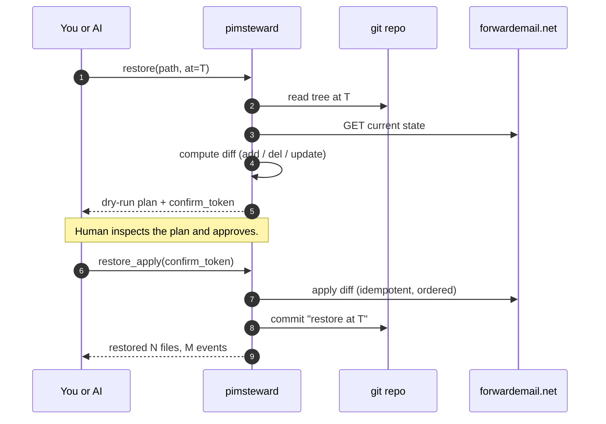

<p align="center">
  
</p>

<p align="center">
  <a href="LICENSE"></a>
  
  
  
  <a href="PLAN.md"></a>
</p>

> **pimsteward** is a **PIM steward for [forwardemail.net](https://forwardemail.net)** — a
> permission-aware MCP mediator between an AI assistant and your mail, calendar,
> contacts, and sieve rules, with time-travel backup built in.

---

## Why pimsteward exists

Giving an AI assistant access to your personal data is a one-way trust decision
**unless you have receipts**. An MCP server that hands raw IMAP/CalDAV
credentials to an LLM is a liability — one hallucinated tool call away from
deleting a decade of archived mail or rewriting your calendar.

pimsteward is the **receipts layer** between the model and your data:

- The AI talks to pimsteward over MCP. It **never** sees your credentials.
- Every write is gated by a per-resource permission policy you control.
- Every change — whether it came from the AI, your phone's CalDAV client, or
  forwardemail itself — lands in a **local git repo** as a time-series log.
- If something goes wrong, you **rewind** by file, directory, or date range.

If the AI deletes all your events next month, you restore them. If you just want
to see what it changed today, you ask `git log`.

---

## Why [forwardemail.net](https://forwardemail.net)

pimsteward is a forwardemail-only tool on purpose. A mediator like this needs
a backend with a real programmatic surface, stable resource ids, and
credentials that can be scoped to a single mailbox — forwardemail has all
three.

- **A real, first-class REST API.** forwardemail ships a
  [well-documented REST API](https://forwardemail.net/en/email-api) covering
  mail, folders, calendars, contacts, sieve filters, aliases, and domains.
  It's not a scraping-friendly afterthought bolted onto a webmail UI — it's
  the same API the service uses internally. JSON in, JSON out, pagination,
  cursors, the lot.
- **Alias-scoped credentials.** Every alias gets its own username/password
  that authorises *only* that alias's data. pimsteward holds an alias
  credential, not a god-mode account token, so the blast radius of the
  daemon is exactly one mailbox.
- **Programmatic by design.** IMAP, CalDAV, CardDAV, and the REST API all
  see the same authoritative store. You can read mail with the REST API,
  write events with CalDAV from your phone, manage sieve rules from a
  script, and pimsteward's pull loop will still capture every change —
  because forwardemail exposes the full state through every interface.
- **Open-source and
  [privacy-focused](https://forwardemail.net/en/privacy).** The
  [service itself is open-source](https://github.com/forwardemail/forwardemail.net),
  quota and rate limits are published, and the company's business model is
  paid accounts rather than mining your mail. That matters when you're
  deciding which provider gets to sit under an AI mediator.
- **MCP-friendly shape.** Because every resource (message, event, vcard,
  sieve script) is addressable by a stable id through a typed API, it maps
  cleanly onto a small set of MCP tools. pimsteward's MCP layer is thin —
  permission check, forwardemail call, git commit — precisely because the
  backend was already programmatic.

If forwardemail didn't exist, pimsteward would need to be five times the code
and half as reliable. Give them [a look](https://forwardemail.net) — and, if
you end up running pimsteward, a paid plan.

---

## What it does

<table>
<tr>
<td width="33%" valign="top">

### Mediates
Your AI talks to pimsteward over MCP, not to forwardemail directly.
pimsteward holds the credentials, enforces a per-resource permission
policy, and attributes every write so you can see exactly what the AI
changed — and when, and why.

</td>
<td width="33%" valign="top">

### Backs up
Every change to your calendars, contacts, mail, or sieve scripts lands
in a local git repository as a time-series log. Whether the change
came from your AI, your IMAP/CalDAV client, or forwardemail itself,
it's captured, diffed, and committed.

</td>
<td width="33%" valign="top">

### Restores
Rewind any file, directory, or date range back to a prior state,
selectively. Your AI can drive the restore too — but only through a
dry-run tool that requires explicit confirmation before any bytes
are written back to forwardemail.

</td>
</tr>
</table>

---

## What can you do with this?

Once pimsteward is wired up to your AI assistant, "PIM assistant" stops being
a demo and starts being a daily driver. Some of the things it's built for:

#### 📬 Mail — triage, search, summarise
- **"What landed in my inbox this week that I haven't replied to?"** — the AI
  runs a proper full-text + header search via forwardemail's API, summarises,
  and proposes next actions.
- **"Move anything from my accountant into the `taxes/` folder."** — batch
  label/move operations across folders, logged and reversible.
- **"Draft a reply to the Monday thread, polite decline."** — the AI writes
  into your Drafts folder; you hit send.
- **"Find every email that mentions project Gemini between Feb and April."**
  — advanced search passed through to forwardemail, with results streamed
  back over MCP so the assistant can reason across the full corpus.

#### 🧹 Mail filtering — sieve rules as code
- **"Any email from `@forwardemail.net` should skip the inbox and land in
  `providers/`."** — the AI proposes a sieve rule; pimsteward previews the
  diff against your current script, commits it, and uploads it.
- **"Auto-archive newsletters older than a week."** — pimsteward edits
  your sieve script, commits to git, and you get a clean rollback path if
  the rule turns out to be too aggressive.
- Every sieve change is a git diff you can `blame`, `revert`, or time-travel.

#### 📅 Calendar — scheduling without the dance
- **"Find me three 30-minute slots next week that don't clash with travel."**
  — the AI reads your calendars and proposes slots.
- **"Book it, invite Sam, title 'design review'."** — an actual `create_event`
  write, committed to git with AI attribution.
- **"Undo everything the AI moved on my calendar today."** — one restore
  tool call, dry-run plan first, then apply.

#### 👥 Contacts — dedupe, enrich, tidy
- **"Merge the two 'Alex Kim' entries and keep the newer phone number."**
- **"Add everyone I've exchanged more than five emails with this year to my
  address book."**
- **"Who on my contact list is missing a company?"** — AI reads, proposes
  patches, writes vcards on approval.

#### ⏪ Time-travel across all of it
- **"What did my calendar look like on March 1st before the reorg?"** —
  pimsteward checks out the git tree at that timestamp and hands it back.
- **"Show me every change the AI made to my contacts this month."** —
  `git log` restricted to the contacts path, filtered by the `ai:` commit
  prefix.
- **"Restore my `newsletters/` folder to where it was Friday morning."** —
  dry-run diff, confirm, apply.

The through-line: **everything the AI does is a commit, everything is
reversible, everything is attributable.**

---

## Architecture

pimsteward is a single daemon that owns your forwardemail credentials and sits
between the AI assistant and the service. It exposes an MCP server upward, a
git repository sideways, and the forwardemail REST API downward.



### Four loops, one data store

| Loop         | Trigger                 | What happens                                                            |
| ------------ | ----------------------- | ----------------------------------------------------------------------- |
| **Pull**     | systemd timer (~5 min)  | Poll forwardemail, diff against the git tree, commit any new state      |
| **Write**    | MCP tool call           | Stage intended change, apply via API, commit with AI attribution        |
| **Restore**  | MCP tool or CLI         | Read git tree at time T, compute diff vs live, apply as a new commit    |
| **GC**       | weekly systemd timer    | `git gc --auto` so the offsite-mirrored backup stays compact            |

---

## How a write actually works

Every AI-initiated mutation goes through a **write-ahead log**: the intent is
committed to git *before* the forwardemail API is touched, and the outcome is
committed *after*. That way a crash mid-write never loses attribution or
silently diverges from the remote.



---

## Restore — with a safety net

Restore is the feature pimsteward exists for. It is also the feature most
likely to be catastrophic if it goes wrong, so the tool is **dry-run by
default** and requires an explicit confirmation token to apply.



### Restore in practice — three scenarios

The easiest way to understand restore is to watch it fix mistakes. These
are shown using the `pimsteward` CLI; the same operations are available
to the AI via MCP tools (`restore_plan` + `restore_apply`), which is how
you'd drive them from inside a conversation.

#### Scenario 1 — "the AI archived a newsletter I wanted to keep in my inbox"

You asked the assistant to clean up your inbox this morning. It filed
fifteen newsletters to `archive/newsletters/`, but one of them — the
Friday edition of a newsletter you actually read — should have stayed
put.

```sh
# 1. See what changed in the last hour, scoped to mail.
pimsteward log --since "1 hour ago" --path sources/forwardemail/*/mail/

# 2. Find the specific move. Commit looks like:
#    ai: move 15 messages → archive/newsletters/
#    Source: ai
#    Tool: bulk_move
#    Session: 01HXYZ...

# 3. Dry-run a restore of just that message back to where it was.
pimsteward restore plan \
    --path 'sources/forwardemail/*/mail/inbox/2026-04-05-signal-weekly/' \
    --at 'HEAD~1'            # the commit before the bulk move

# Prints: 1 message will be moved: archive/newsletters/ → inbox/

# 4. Apply it.
pimsteward restore apply --token <token-from-dry-run>
```

The other fourteen archived messages stay archived. Restore is a
**selective** git checkout, not a global rewind.

#### Scenario 2 — "the AI rewrote my sieve filter and now mail is going to the wrong folder"

You gave the assistant `sieve = "readwrite"` last week. Overnight it
"optimised" your filter script, and now messages from your accountant
are landing in `spam/` instead of `taxes/`.

```sh
# 1. What did the sieve file look like yesterday morning?
pimsteward show --path 'sources/forwardemail/*/sieve/inbox.sieve' \
                --at '2026-04-04T09:00Z'

# 2. Diff yesterday against now to see exactly what the AI changed.
pimsteward diff --path 'sources/forwardemail/*/sieve/inbox.sieve' \
                --from '2026-04-04T09:00Z' --to HEAD

# 3. Roll the file back.
pimsteward restore plan \
    --path 'sources/forwardemail/*/sieve/inbox.sieve' \
    --at '2026-04-04T09:00Z'

pimsteward restore apply --token <token>
```

The restore is committed as a new commit with `Source: restore` and a
reference back to the commit being reverted, so the audit trail shows
both the AI's change and your undo.

#### Scenario 3 — "the AI merged two contacts and kept the wrong one"

The assistant helpfully deduped your address book, but it chose the
older "Alex Kim" vcard and dropped the newer phone number you'd added
last week.

```sh
# 1. Find the merge commit.
pimsteward log --path 'sources/forwardemail/*/contacts/' --grep 'merge'

# 2. Show the deleted vcard as it was just before the merge.
pimsteward show --path 'sources/forwardemail/*/contacts/main/alex-kim-b.vcf' \
                --at 'HEAD~1'

# 3. Restore that single vcard. The AI-preferred one stays — you end
#    up with both, and can tidy them yourself.
pimsteward restore plan \
    --path 'sources/forwardemail/*/contacts/main/alex-kim-b.vcf' \
    --at 'HEAD~1'

pimsteward restore apply --token <token>
```

In every case the pattern is the same: **narrow the path, pick the
time, dry-run, confirm, apply.**

---

## Auditing what the AI did

pimsteward is a backup *and* an audit tool. Every AI-initiated change
leaves two traces:

1. **A git commit** with a structured footer identifying source, tool,
   and session — so `git log` is your primary audit log.
2. **A line in `audit/mutations.jsonl`** — an append-only, human-
   readable JSON-lines log you can grep, pipe into `jq`, or load into
   any log tooling.

### Commit shape

Every mutation commit carries trailers that make filtering easy:

```
ai: create_event work-cal/2026-04-10-design-review

Source: ai
Tool: create_event
Session: 01HXYZ7P2Q3R4S5T6V
Resource: calendar
Alias: pimsteward_test@example.dev
```

`Source:` is one of `ai`, `pull`, or `restore`. `Tool:` names the MCP
tool that was invoked. `Session:` ties together every mutation from a
single AI conversation, so you can see a burst of related changes as
one coherent action.

### Asking "what did the AI change today?"

```sh
# Every AI-authored change today, newest first, scoped to one alias.
git -C /data/Backups/$(hostname)/pimsteward/<alias_slug> \
    log --since=midnight --grep='^Source: ai$'

# Same question, but just the files touched.
git -C .../<alias_slug> \
    log --since=midnight --grep='^Source: ai$' --name-status

# All changes from a single AI session — useful when the assistant did
# a burst of edits and you want to review them as a unit.
git -C .../<alias_slug> \
    log --grep='Session: 01HXYZ7P2Q3R4S5T6V'

# "Who last touched this specific calendar event?"
git -C .../<alias_slug> \
    blame sources/forwardemail/*/calendars/work/events/01HXYZ....ics
```

Because the repo is just git, **everything you already know about git
works here**. `git log -p`, `git log --stat`, `gitk`, `tig`,
`lazygit`, VS Code's git lens — all of them become audit tools for
your AI.

### The mutations log

For the cases where you want something less git-shaped — dashboards,
alerts, "email me if the AI ever deletes more than ten messages in a
day" — there's `audit/mutations.jsonl`:

```jsonl
{"ts":"2026-04-05T08:14:22Z","source":"ai","tool":"create_event","resource":"calendar","path":"calendars/work/events/01HXYZ....ics","session":"01HXYZ7P2Q3R4S5T6V","result":"ok"}
{"ts":"2026-04-05T08:14:23Z","source":"ai","tool":"bulk_move","resource":"mail","count":15,"from":"inbox/","to":"archive/newsletters/","session":"01HXYZ7P2Q3R4S5T6V","result":"ok"}
{"ts":"2026-04-05T08:14:24Z","source":"ai","tool":"delete_message","resource":"mail","result":"denied","reason":"permission: email=drafts"}
```

Note the last line: **denied attempts are logged too.** If your AI
repeatedly tries to do things its permission level forbids, that's a
signal worth surfacing — pimsteward captures it whether or not the
operation succeeded.

```sh
# Show every AI mutation today, pretty-printed.
jq -c 'select(.source=="ai" and (.ts | startswith("2026-04-05")))' \
    /data/Backups/.../<alias_slug>/audit/mutations.jsonl

# Count by tool — where is the AI spending its write budget?
jq -r 'select(.source=="ai") | .tool' mutations.jsonl | sort | uniq -c | sort -rn

# Every denied attempt this week.
jq -c 'select(.result=="denied")' mutations.jsonl
```

The combination — structured commits for narrative review, JSON-lines
for tooling — is the whole point of pimsteward. You don't audit the
AI by asking it what it did. You audit the AI by looking at the trail
it couldn't avoid leaving.

---

## Permission model — a trust gradient you control

Trust in an AI assistant is not binary, and neither is pimsteward. You set one
policy per resource type, and you turn the dials up as the assistant earns it.

| Level           | What the AI can do                                                           | Where it makes sense                  |
| --------------- | ---------------------------------------------------------------------------- | ------------------------------------- |
| **`none`**      | Resource is invisible — the MCP tools aren't even registered                 | Data you simply don't want AI near    |
| **`read`**      | Search, read, summarise, quote — zero writes                                 | The safe default for everything       |
| **`drafts`**    | *(email only)* read + create messages **only in your Drafts folder**         | Letting an AI help write replies      |
| **`readwrite`** | Full CRUD: create, update, delete, move, send                                | Once the AI has earned it             |

### A typical progression

**Week one — "read-only everywhere that matters."**

```toml
[permissions]
email    = "read"        # AI can search and summarise, never modify
calendar = "readwrite"   # calendar mistakes are cheap and reversible
contacts = "readwrite"   # same — and dedupe is a great first task
sieve    = "read"        # look but don't touch your filter rules yet
```

Your assistant can triage your inbox, summarise threads, find meetings,
propose sieve rules as *suggestions* — but it cannot touch a single byte of
mail. This is where most people should start.

**Month two — "you can draft, I'll send."**

```toml
[permissions]
email    = "drafts"      # AI writes replies into Drafts only
calendar = "readwrite"
contacts = "readwrite"
sieve    = "readwrite"   # AI now owns your filter rules (every change is a git diff)
```

The `drafts` tier is the middle step people actually want from an AI mail
assistant: it can compose, quote, and thread replies into your Drafts folder,
but it cannot send, delete, move, or modify any existing message. You review
and hit send yourself.

**Once the AI has earned it — "full trust, with receipts."**

```toml
[permissions]
email    = "readwrite"   # full CRUD, including send
calendar = "readwrite"
contacts = "readwrite"
sieve    = "readwrite"
```

At this point the assistant can autonomously triage, reply, file, and archive.
The safety net is not the permission bit — it's the fact that **every mutation
is still committed to git with AI attribution**, and `restore` can rewind any
path to any point in time. You are trading convenience for the need to
occasionally audit a `git log`, not for blind faith.

### The rest of the config

```toml
# /etc/pimsteward/config.toml

[forwardemail]
api_base            = "https://api.forwardemail.net"
alias_user_file     = "/run/pimsteward-secrets/forwardemail-alias-user"
alias_password_file = "/run/pimsteward-secrets/forwardemail-alias-password"

[storage]
repo_path = "/data/Backups/<host>/pimsteward/<alias_slug>"

[mcp]
listen = "unix:/run/pimsteward/mcp.sock"
```

Permission checks happen **before** any API call and **before** any git write.
A `none` resource is invisible to the AI: the corresponding MCP tools are not
registered at all, so the model never even learns they exist. Per-folder and
per-calendar rules (e.g. "write to `work-cal` but never `family-cal`") are an
explicit v2 question — v1 keeps the dials coarse on purpose.

---

## Storage layout

One repository per forwardemail alias. One file per logical resource. Commits
are atomic batches with a machine-readable footer identifying the source
(`pull`, `ai`, `restore`).

```
/data/Backups/<host>/pimsteward/<alias_slug>/
├── .git/
├── sources/forwardemail/<alias_slug>/
│   ├── calendars/<cal_id>/_meta.json
│   ├── calendars/<cal_id>/events/<uid>.ics
│   ├── contacts/<book_id>/_meta.json
│   ├── contacts/<book_id>/<uid>.vcf
│   ├── mail/<folder_id>/_meta.json
│   ├── mail/<folder_id>/<msg_id>/raw.eml         # immutable body + headers
│   ├── mail/<folder_id>/<msg_id>/meta.json       # flags, folder — mutable
│   ├── mail/_attachments/<sha256>                # dedup
│   └── sieve/<script_name>.sieve
├── _sync/
│   └── state.json            # poll cursors, last successful run per resource
└── audit/
    └── mutations.jsonl       # append-only human-readable log of AI writes
```

### Why git (and [gix](https://github.com/GitoxideLabs/gitoxide) specifically)

Git gives us content-addressed storage, diff / blame, time-travel, branching,
and the best ecosystem tooling in the world — for free. gix (gitoxide) is
chosen over git2 (libgit2 bindings) because it's pure Rust, and over jj-lib
because pimsteward's VCS needs are deliberately linear and boring: append-only
writes, single writer, no merge conflicts.

---

## Non-goals

- ❌ **Not a generic backup tool.** Use restic or borg for disk-level backup.
- ❌ **Not a PIM client.** Keep using your favourite IMAP/CalDAV app — pimsteward
  sits alongside it, not in front of it.
- ❌ **Not a multi-provider sync tool.** v1 is forwardemail-only by design.
  A generic PIM mediator is a bigger, different project.
- ❌ **Not a search index.** forwardemail's own search is excellent; pimsteward
  passes queries through rather than re-indexing.
- ❌ **Not a rate-limit bypass.** All AI reads and writes still hit
  forwardemail's API with your credentials — they're just mediated.

---

## Testing

Unit tests run against fakes and never touch the network:

```sh
cargo test
```

The interesting tests are the **end-to-end** suite, which drives the real
forwardemail REST API and IMAP/CalDAV/CardDAV endpoints. Because those tests
create, modify, and delete live resources, they are gated behind an explicit
opt-in **and** a safety guard that refuses to run against anything that isn't
a test alias.

```sh
export PIMSTEWARD_RUN_E2E=1
export PIMSTEWARD_TEST_ALIAS_USER_FILE=/path/to/test-alias-email
export PIMSTEWARD_TEST_ALIAS_PASSWORD_FILE=/path/to/test-alias-password

cargo nextest run --run-ignored all
```

### The `_test` alias safety guard

**Every e2e test must use a forwardemail alias whose localpart contains the
substring `_test`.** The guard lives in
[`src/safety.rs`](src/safety.rs) and runs *before* any client is constructed
or any API call is made. If the alias doesn't match, the test **panics
immediately** — it does not return a `Result` you can `?` past or `let _ =`
away. This is intentional: a safety guard that can be silently swallowed
isn't a safety guard.

Concretely, the rule is:

1. The alias must contain `_test` in its localpart — e.g.
   `pimsteward_test@example.dev` ✅, `dan@example.dev` ❌.
2. The alias must not appear on the **explicit deny list** of known
   production addresses (belt-and-braces; the deny list catches hypothetical
   collisions like someone registering `dan_test` on a production domain).
3. Defense in depth: the repo path used by the test must not live under
   `/data/Backups/` or `/var/lib/pimsteward/` — those are reserved for the
   production daemon. Tests use a `tempfile::tempdir()` repo.

The recommended setup is a dedicated forwardemail alias you create just for
this — something like `pimsteward_test@<your-domain>` — with its own
alias-scoped credentials. Never point the test suite at an alias that holds
real mail, even briefly. The guard will stop you, but not pointing the gun
in the first place is better.

See [CONTRIBUTING.md](CONTRIBUTING.md) for the full e2e walkthrough.

---

## Status

Early development. Pull-loop and MCP server are functional; the write path
and restore engine are landing behind them. See [PLAN.md](PLAN.md) for the
full design and phased implementation, and [DESIGN.md](DESIGN.md) for deeper
rationale on the trickier decisions.

Contributions welcome — start with [CONTRIBUTING.md](CONTRIBUTING.md).

---

## License

MIT — see [LICENSE](LICENSE).

<p align="center">
  
</p>
